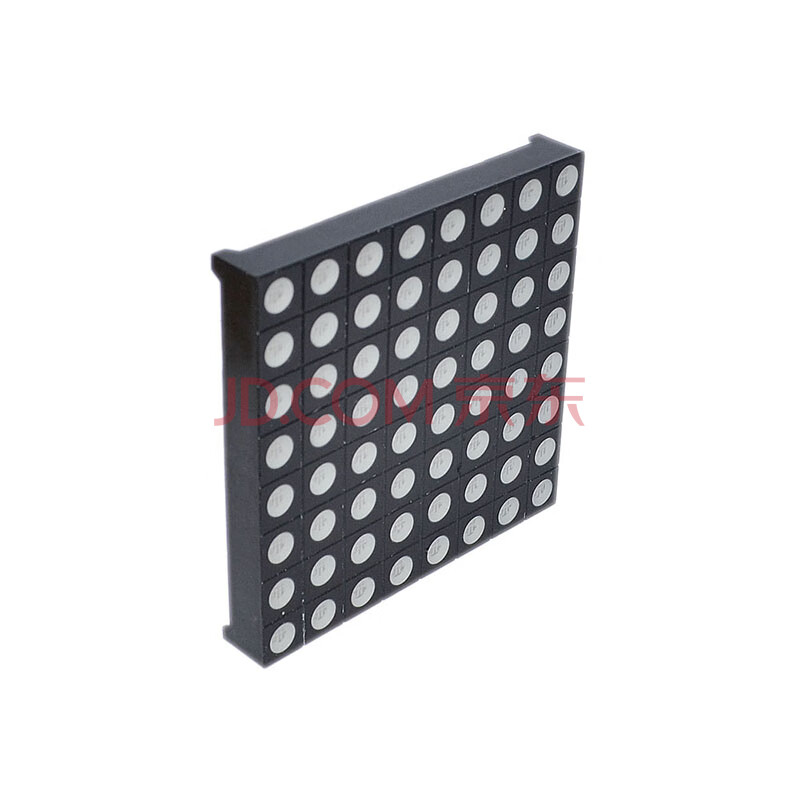

# 说明文档

Created: May 27, 2025 11:18 AM

## 1. 题目说明

⬇️参考说明

https://zhouxzh.github.io/FPGA-course/design/LED_matrix.html

---

### 1.1 点阵模块

https://ic-item.jd.com/10099840704694.html

<aside>

我们计划使用  （8 * 8）  * 4     构成 16 * 16 点阵模块

共阳级 

通过  16 * 2 + 16 个引脚 杜邦线 进行控制

使用 3 - 8 译码器

</aside>

---

### 1.2 FPGA开发板

https://item.jd.com/10036488870096.html

<aside>

使用 ZYNQ7020 FPGA 开发板

</aside>

---

### 1.3 上位机

<aside>

1. 使用树莓派的 Linux 系统作为上位机 对图像解析
2. 通过AXI4 - Full 发送指令及相关信息到指定 地址
3. 通过AXI4 - Full 发送LED阵列控制 结果 到指定地址
</aside>

---

### 1.4 控制系统

<aside>

FPGA 解析相应指令以及 LED整列控制 结果

</aside>

---

## 2. 完成目标

- 点亮LED排
- 流水灯
- PWM调光
- 单灯控制
- 流水灯SPI控制
- 图像数据传输
- 动画显示
- 流水线控制

---

## 3. 工作计划

[FPGA 工作计划](FPGA%20%E5%B7%A5%E4%BD%9C%E8%AE%A1%E5%88%92%20200138099ac180458fadd4514fe7ced3.csv)
